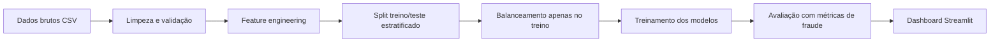

# Detecção de Fraude em Transações Financeiras com Foco em Desbalanceamento Extremo

---

## 1. Introdução [E1]

### 1.1 Título

**Detecção de Fraude em Pagamentos Instantâneos sob Desbalanceamento Extremo**

---

### 1.2 Equipe

| Nome | E-mail SiDi | Papel principal | Contribuição principal (E2) |
|------|-------------|-----------------|----------------------------|
| George Lucas Lopes da Silva | [TODO] | Líder de equipe | [TODO Entrega 2] |
| Lucas Gabriel Carvalho dos Ramos | [TODO] | Líder de dados | [TODO Entrega 2] |
| Alexsandro Barreto de Abreu | alexsandrobarreto400@gmail.com | Líder de modelagem | [TODO Entrega 2] |
| Lucas Jundi Hikazudani | [TODO] | Líder de engenharia | [TODO Entrega 2] |
| Martony Demes da Silva | [TODO] | Líder de avaliação | [TODO Entrega 2] |
| Stefferson Bruno Costa Ferreira | [TODO] | Líder de documentação | [TODO Entrega 2] |
| Todos | Todos | Líder de apresentação | [TODO Entrega 2] |

---

### 1.3 Contexto e motivação

A detecção de fraudes em transações financeiras é um dos problemas centrais de segurança em sistemas de pagamento modernos. No Brasil, o PIX movimentou mais de R$ 22 trilhões em 2024, tornando-se o principal alvo de golpes digitais e fraudes instantâneas. Em fevereiro de 2026, o Banco Central do Brasil publicou o MED 2.0 (Mecanismo Especial de Devolução), tornando obrigatória a adoção de modelos de score de fraude em instituições que operam com pagamentos instantâneos. O desafio central desse domínio não é apenas a acurácia preditiva, mas a capacidade do modelo de operar de forma confiável sob **desbalanceamento extremo**, tipicamente menos de 0,2% das transações são fraudulentas, sem sacrificar recall em nome de precisão, nem gerar volume de falsos positivos que inviabilize a operação.

Este projeto simula esse cenário usando o dataset PaySim, que replica transações de sistemas mobile money com injeção controlada de comportamento fraudulento. Além do aspecto técnico, o problema tem impacto direto em usuários finais (evitar bloqueios indevidos e golpes), em instituições financeiras (custo regulatório e de reputação) e em reguladores (cumprimento do MED 2.0).

---

### 1.4 Problema / pergunta de pesquisa

> **Qual combinação de técnica de balanceamento e algoritmo de classificação produz o maior F1-score na classe minoritária (fraude), mantendo precisão suficiente para ser operacionalmente viável, em um dataset com imbalance ratio superior a 500:1?**

A pergunta é deliberadamente restrita: o foco é **precisão de detecção** (qualidade do modelo), não velocidade de inferência, o dataset é batch-simulado e não impõe restrições de latência nesta etapa.

---

### 1.5 Hipótese

Modelos baseados em árvores com gradient boosting (XGBoost/LightGBM), combinados com ajuste de `scale_pos_weight` ou SMOTE aplicado apenas ao treino, superam um baseline por limiar de valor (regra `amount > threshold`) em F1-score na classe fraude (F1 ≥ 0.85 vs. F1 < 0.50 do baseline), mesmo com imbalance ratio de ~529:1 (8.213 fraudes em 6.362.620 transações).

A hipótese secundária é que **SMOTE não agrega ganho relevante sobre `class_weight="balanced"`** para algoritmos baseados em árvore, conforme indicado pela literatura recente (He & Garcia, 2009; Lemaître et al., 2017), o que será testado empiricamente.

---

### 1.6 Objetivos

1. Realizar EDA completa do dataset PaySim, quantificando o grau de desbalanceamento e os padrões de comportamento por tipo de transação.
2. Implementar e comparar ao menos três estratégias de tratamento de desbalanceamento: (a) sem tratamento, (b) `class_weight="balanced"`, (c) SMOTE no conjunto de treino.
3. Treinar e comparar ao menos dois algoritmos: Logistic Regression (baseline supervisionado), Random Forest e XGBoost/LightGBM.
4. Definir e reportar critérios de sucesso atrelados ao imbalance ratio do dataset, estabelecendo a fronteira de aplicabilidade do modelo (ex.: "modelo válido para IR ≤ 600:1").
5. Desenvolver um dashboard Streamlit com matriz de custo configurável que permita ao usuário simular impacto financeiro de falsos positivos versus falsos negativos.

---

## 2. Dados

### 2.1 Fonte e licença [E1]

- **Dataset:** PaySim Synthetic Financial Transactions Dataset
- **URL:** https://www.kaggle.com/datasets/ealaxi/paysim1
- **Licença:** CC BY-SA 4.0 (uso acadêmico permitido)
- **Data de acesso:** junho/2026
- **Versão:** versão única disponível no Kaggle (`PS_20174392719_1491204439457_log.csv`)
- **Autenticação:** requer conta Kaggle + `kagglehub` ou API key

---

### 2.2 Volume e formato [E1]

| Atributo | Valor |
|----------|-------|
| Amostras | 6.362.620 transações |
| Colunas | 11 variáveis |
| Tamanho em disco | ~470 MB (CSV) |
| Formato | CSV (single file) |
| Periodicidade | Simulação de 30 dias (744 passos de 1 hora) |
| Imbalance ratio | ~529:1 (0,1290% de fraudes) |

---

### 2.3 Variáveis principais [E1]

| Variável | Tipo | Descrição |
|----------|------|-----------|
| `step` | int | Unidade de tempo em horas (1-744, simulando 30 dias) |
| `type` | categórico | Tipo de transação: CASH-IN, CASH-OUT, DEBIT, PAYMENT, TRANSFER |
| `amount` | float | Valor da transação em moeda local; alta assimetria (max ~92M) |
| `oldbalanceOrg` | float | Saldo do remetente antes da transação |
| `newbalanceOrig` | float | Saldo do remetente após a transação |
| `oldbalanceDest` | float | Saldo do destinatário antes da transação |
| `newbalanceDest` | float | Saldo do destinatário após a transação |
| `isFraud` | binário (0/1) | **Variável alvo** - 1 indica transação fraudulenta |
| `isFlaggedFraud` | binário (0/1) | Regra do sistema original: precision=1.0, recall≈0.002 |
| `nameOrig` | string | ID do remetente (alta cardinalidade - >6M valores únicos) |
| `nameDest` | string | ID do destinatário (alta cardinalidade) |

**Observação da EDA:** Fraudes ocorrem **exclusivamente** em transações do tipo `CASH_OUT` e `TRANSFER`. As demais categorias (`PAYMENT`, `CASH-IN`, `DEBIT`) não apresentam nenhum registro fraudulento, isso será tratado como feature determinística, com cuidado para não introduzir data leakage implícito.

---

### 2.4 Riscos de dados [E1]

| Risco | Descrição | Mitigação planejada |
|-------|-----------|---------------------|
| **Desbalanceamento extremo** | IR ~529:1 - métricas de acurácia são enganosas | Usar F1, PR-AUC e recall como métricas primárias; testar SMOTE e class_weight |
| **Data leakage via saldos** | `oldbalanceOrg - amount ≠ newbalanceOrig` em 85% dos casos; pode codificar fraude diretamente | Engenharia de features cuidadosa; validar importância pós-treino |
| **Alta cardinalidade** | `nameOrig` e `nameDest` com >6M valores únicos | Remover ou substituir por features derivadas (ex.: frequência do destino) |
| **Dataset sintético** | Padrões podem ser mais claros do que no mundo real; risco de overfitting ao simulador | Documentar limitação; não extrapolar resultados sem validação em dados reais |
| **Ausência de PII** | Dataset sintético, sem dados pessoais identificáveis | N/A; uso acadêmico sem restrições éticas adicionais |
| **Drift temporal** | Variação da taxa de fraude ao longo das 744 horas simuladas | Analisar distribuição temporal; considerar split temporal no protocolo de validação |

---

### 2.5 Pré-processamento aplicado [E2]

[TODO Entrega 2]

---

### 2.6 Ética e privacidade [E1]

O dataset é **sintético**, gerado por simulação (PaySim), sem qualquer dado pessoal real. Não contém PII. A licença CC BY-SA 4.0 permite uso acadêmico irrestrito com atribuição. Não há necessidade de anonimização adicional. O único aspecto ético relevante é o risco de **fairness** em aplicações reais derivadas: modelos treinados em dados sintéticos podem não refletir vieses socioeconômicos presentes em transações reais, e não devem ser aplicados diretamente em produção sem validação externa.

---

## 3. Metodologia

### 3.1 Abordagem [E1]

**Aprendizado supervisionado - classificação binária** com foco em recall da classe positiva (fraude).

A escolha é direta: temos rótulos disponíveis (`isFraud`) e o problema é binário. O principal desafio metodológico não é o algoritmo em si, mas o **protocolo de balanceamento**, que determina como o modelo aprende com a classe minoritária.

**Referências que guiam a abordagem:**
- Chawla et al. (2002) - SMOTE original: gera amostras sintéticas por interpolação entre vizinhos da classe minoritária. Funciona bem para SVM e modelos lineares, mas a literatura indica ganho marginal para tree ensembles.
- He & Garcia (2009) - revisão sistemática de imbalanced learning: recomenda combinar reamostragem com ajuste de threshold, não apenas de dados.
- Lemaître et al. (2017) - `imbalanced-learn`: documenta que SMOTE muitas vezes não supera `class_weight` em Random Forest/XGBoost, especialmente com IR > 100:1.
- López et al. (2013) - análise de técnicas em IR extremo (>1000:1): recomenda ADASYN ou Borderline-SMOTE como alternativas mais robustas ao SMOTE clássico.
- Fernández et al. (2018) - *Learning from Imbalanced Data Sets* (Springer): framework completo que usaremos como referência metodológica central.

Com base na literatura, **não implementaremos SMOTE cegamente** - compararemos com `class_weight` e, se pertinente, testaremos ADASYN como alternativa.

---

### 3.2 Stack técnica [E1]

| Componente | Tecnologia |
|------------|------------|
| Linguagem | Python 3.11+ |
| Manipulação de dados | pandas, NumPy |
| Visualização | matplotlib, seaborn |
| ML / modelagem | scikit-learn, XGBoost, LightGBM |
| Balanceamento | imbalanced-learn (SMOTE, ADASYN, BorderlineSMOTE) |
| Tracking de experimentos | MLflow (local) |
| Dashboard | Streamlit |
| Aquisição de dados | kagglehub |
| Reprodutibilidade | `random_state=42` global; `requirements.txt` / `pyproject.toml` |

---

### 3.3 Baselines [E1]

| Baseline | Descrição |
|----------|-----------|
| **Regra de limiar** | `isFraud = 1` se `amount > threshold` (threshold = 200.000). Representa o sistema atual (`isFlaggedFraud` tem precisão 1.0 mas recall ≈ 0.002). |
| **Dummy classifier** | Sempre prediz classe majoritária (0). F1 fraude = 0. Referência inferior. |
| **Logistic Regression** | Com `class_weight="balanced"` e features básicas. Baseline supervisionado linear. |

O objetivo é que XGBoost/LightGBM com balanceamento adequado supere todos os baselines em F1-score da classe fraude.

---

### 3.4 Pipeline [E2]

[TODO Entrega 2]



---

### 3.5 Modelos comparados [E2]

[TODO Entrega 2]

---

### 3.6 Protocolo de validação [E1]

- **Split:** 80% treino / 20% teste, estratificado por `isFraud` (para garantir representação da classe minoritária em ambas as partições).
- **Semente global:** `random_state = 42` em todas as operações aleatórias.
- **Sem data leakage:** balanceamento (SMOTE/ADASYN) aplicado **somente ao conjunto de treino**, nunca ao teste.
- **Validação cruzada:** Stratified K-Fold (k=5) para seleção de hiperparâmetros, com `StratifiedKFold` do scikit-learn.
- **Consideração temporal:** dado que o dataset simula 30 dias sequenciais, avaliaremos um split temporal alternativo (treino: horas 1–600, teste: horas 601–744) para verificar se o modelo generaliza temporalmente.
- **Anti-leakage específico:** as variáveis `isFlaggedFraud`, `nameOrig` e `nameDest` serão removidas antes de qualquer treino. Features derivadas de saldo serão inspecionadas via importância de features pós-treino.

---

### 3.7 Métricas e critérios de sucesso [E1]

A escolha de métricas é guiada pelo custo assimétrico do problema: um **falso negativo** (fraude não detectada) tem custo financeiro e regulatório muito maior do que um **falso positivo** (transação legítima bloqueada).

| Métrica | Justificativa | Valor mínimo aceitável |
|---------|--------------|------------------------|
| **F1-score (classe fraude)** | Harmônico entre precisão e recall; métrica principal para classe minoritária | ≥ 0.85 |
| **Recall (classe fraude)** | Captura a cobertura de fraudes reais; crítico para conformidade regulatória | ≥ 0.80 |
| **PR-AUC** (Precision-Recall AUC) | Mais informativa que ROC-AUC em desbalanceamento extremo | ≥ 0.80 |
| **Precisão (classe fraude)** | Controla volume de falsos positivos; viabilidade operacional | ≥ 0.70 |

**Por que não usar ROC-AUC como primária:** em datasets com IR > 100:1, a ROC-AUC é otimistamente enviesada pela abundância de verdadeiros negativos. PR-AUC é mais discriminativa nesse cenário (Davis & Goadrich, 2006).

**Critério de fronteira de aplicabilidade:** o modelo será considerado válido para datasets com imbalance ratio de até **600:1**. Acima disso, os resultados devem ser revalidados com técnicas adicionais (ex.: ensemble de detectores de anomalia + classificador supervisionado).

---

## 4. Cronograma [E1: planejado; E2: status]

| Semana | Período | Marco / atividade prevista | Status (E2) |
|--------|---------|---------------------------|-------------|
| 1 | 29/mai – 05/jun | Definição do tema + aquisição do dataset PaySim + EDA inicial (distribuições, tipos, IR) | [TODO E2] |
| 2 | 06–12/jun | EDA aprofundada: análise temporal, correlações, inconsistências de saldo, data quality | [TODO E2] |
| 3 | 13–19/jun | Implementação dos baselines (regra de limiar + Logistic Regression) + métricas de referência | [TODO E2] |
| 4 | 20–26/jun | Feature engineering + treinamento de Random Forest e XGBoost v1 com SMOTE e class_weight | [TODO E2] |
| 5 | 27/jun – 03/jul | **Entrega 1 (30/jun)** + refinamento pós-feedback: ajuste de hiperparâmetros iniciais | [TODO E2] |
| 6 | 04–10/jul | Tuning via Optuna/GridSearch + ablation: SMOTE vs. ADASYN vs. class_weight | [TODO E2] |
| 7 | 11–17/jul | Análise de erros: casos sistemáticos de FP/FN + inspeção de importância de features | [TODO E2] |
| 8 | 18–24/jul | Dashboard Streamlit com matriz de custo + documentação final (seções E2) + ensaio de demo | [TODO E2] |
| 9 | 25–31/jul | **Entrega 2 (31/jul)** - slides + defesa no seminário | [TODO E2] |

Aprendizado sobre desvios (E2): [TODO Entrega 2]

---

## 5. Resultados [E2]

### 5.1 Métricas obtidas

[TODO Entrega 2]

| Modelo | F1 (fraude) | Recall (fraude) | PR-AUC | Precisão (fraude) |
|--------|------------|-----------------|--------|-------------------|
| Baseline: regra de limiar | [TODO] | [TODO] | [TODO] | [TODO] |
| Baseline: Logistic Regression | [TODO] | [TODO] | [TODO] | [TODO] |
| Random Forest + class_weight | [TODO] | [TODO] | [TODO] | [TODO] |
| XGBoost + SMOTE | [TODO] | [TODO] | [TODO] | [TODO] |
| Melhor modelo final | [TODO] | [TODO] | [TODO] | [TODO] |

### 5.2 Gráficos relevantes

[TODO Entrega 2] - Incluir em `docs/figs/`: matriz de confusão, curva PR, curva ROC, importância de features (SHAP), distribuição de scores por classe.

### 5.3 Análise de erros

[TODO Entrega 2]

### 5.4 Comparação com a hipótese

[TODO Entrega 2]

---

## 6. Conclusão [E2]

### 6.1 Principais achados

[TODO Entrega 2]

### 6.2 Limitações

[TODO Entrega 2]

### 6.3 Trabalhos futuros

[TODO Entrega 2]

### 6.4 Aprendizados da equipe

[TODO Entrega 2]

---

## 7. Reprodutibilidade [E2]

### 7.1 Requisitos

- Python [TODO Entrega 2 - ex.: 3.11+]
- [TODO Entrega 2 - lista de libs ou referência ao `pyproject.toml`]
- Sistema operacional testado: [TODO Entrega 2]
- Semente global: `42`

### 7.2 Instalação

```bash
git clone [TODO URL]
cd [TODO nome-do-projeto]

# Com uv (recomendado)
uv sync

# Alternativa
pip install -r requirements.txt
```

### 7.3 Obter os dados

```bash
# [TODO Entrega 2]
# Ex.: make download-data
# Ou manualmente via kagglehub:
# python -c "import kagglehub; kagglehub.dataset_download('ealaxi/paysim1')"
```

### 7.4 Executar o pipeline

```bash
# [TODO Entrega 2]
# Ex.:
# make train
# make evaluate
# make report
```

### 7.5 Rodar os testes

```bash
# [TODO Entrega 2]
# Ex.: pytest -v
```

### 7.6 Artefatos gerados

[TODO Entrega 2] - Listar o que será gerado em `artifacts/`, `models/`, `reports/`.

---

## Referências

- Chawla, N. V., et al. (2002). SMOTE: Synthetic Minority Over-sampling Technique. *JAIR*, 16, 321–357.
- Davis, J., & Goadrich, M. (2006). The relationship between Precision-Recall and ROC curves. *ICML*.
- Fernández, A., et al. (2018). *Learning from Imbalanced Data Sets*. Springer.
- He, H., & Garcia, E. A. (2009). Learning from Imbalanced Data. *IEEE TKDE*, 21(9), 1263–1284.
- Lemaître, G., et al. (2017). Imbalanced-learn: A Python Toolbox. *JMLR*, 18(17), 1–5.
- López, V., et al. (2013). An insight into classification with imbalanced data. *Information Sciences*, 250, 113–141.
- Lopez-Rojas, E. A., et al. (2016). PaySim: A financial mobile money simulator. *EMSS*.
- Banco Central do Brasil (2026). Resolução BCB nº MED 2.0 - Mecanismo Especial de Devolução atualizado.
